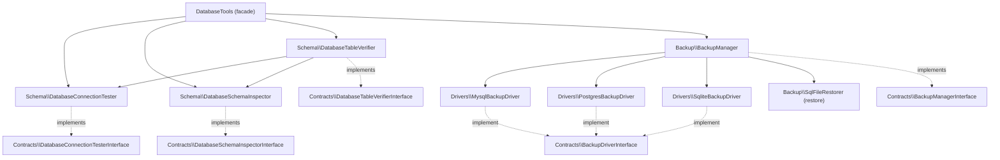

# Architecture

A high-level map of how `laranail/database-tools` is wired together. The
namespace root for every class is `Simtabi\Laranail\DatabaseTools\`.

## Overview

The `DatabaseTools` facade is a thin, static entry point. It resolves the
container-bound service contracts and delegates to them — it holds no state of
its own. The schema services each have a single responsibility (connection
testing, schema inspection, table verification), and `BackupManager` uses a
driver pattern to pick the right backup strategy per database driver.



Notably, `DatabaseTableVerifier` is constructed with the connection tester and
schema inspector contracts injected, so it composes the other two services
rather than re-querying the database directly.

## Independence invariant

`database-tools` is genuinely **independent**: it depends only on `illuminate/*`
plus a few small utility libraries (`ramsey/uuid`, `symfony/uid`,
`spatie/laravel-sluggable`). It **never** depends on `laranail/package-tools`
or any other Laranail package, and nothing in this package reaches into one.
That separation is deliberate and load-bearing — it is what lets you pull these
database utilities into any Laravel app without dragging in the package-author
toolchain.

The division of labour across the suite reflects this: **seeding** lives in
`laranail/package-tools`, and the **seed console formatter** lives in
`laranail/console` — neither belongs here. Every PR that touches
`composer.json` is reviewed against this invariant, and the `require` block must
stay free of any `laranail/*` entry.

## Contracts

**`Schema/Contracts/`**

- `DatabaseConnectionTesterInterface` — `test`, `testDetailed`, `getDriver`,
  `getVersion`, `getDatabaseName`.
- `DatabaseSchemaInspectorInterface` — `getTables`, `hasTable`,
  `getTableCount`, `getColumns`, `hasColumn`, `hasColumns`.
- `DatabaseTableVerifierInterface` — `verify`, `verifyDetailed`,
  `getExistingTables`, `getMissingTables`, `hasLaravelTables`.

**`Backup/Contracts/`**

- `BackupManagerInterface` — `backup`, `restore`, `supportsDriver`.
- `BackupDriverInterface` — `backup(array $config, string $path)`, `supports`.

## `src/` tree

```
src/
├── DatabaseTools.php              # static facade-style entry point
├── Facades/
│   └── DatabaseToolsFacade.php    # Laravel Facade -> DatabaseTools
├── Providers/
│   └── DatabaseToolsServiceProvider.php
├── Schema/
│   ├── DatabaseConnectionTester.php
│   ├── DatabaseSchemaInspector.php
│   ├── DatabaseTableVerifier.php
│   ├── AuditColumnsMacro.php         # auditColumns() blueprint macro
│   ├── SoftDeletesWithUndoMacro.php  # softDeletesWithUndo() blueprint macro
│   ├── BlueprintMacros.php           # extended Blueprint (configurable id type)
│   ├── Concerns/                     # HasSchemaInspection, HasSchemaOperations
│   └── Contracts/
├── Backup/
│   ├── BackupManager.php
│   ├── SqlFileRestorer.php
│   ├── Drivers/
│   │   ├── MysqlBackupDriver.php
│   │   ├── PostgresBackupDriver.php
│   │   └── SqliteBackupDriver.php
│   └── Contracts/
├── Concerns/                      # model traits (UUID/ULID/NanoID, scopes, …)
├── Casts/
│   ├── CastMoney.php
│   └── CastDatetime.php
├── Observers/
│   └── AuditObserver.php
├── Events/
│   ├── BaseEvent.php
│   └── DatabaseEvents.php
├── Models/
│   └── BaseModel.php               # optional base Eloquent model
├── Exceptions/
├── Files/
└── Services/
```

## See also

- [facade.md](tools/facade.md) — the unified entry point
- [backup-restore.md](tools/backup-restore.md) — driver resolution flow
- Worked example: [`docs/examples/Order.php`](examples/Order.php) +
  [`docs/examples/OrderMigration.php`](examples/OrderMigration.php)

---
[← Docs index](../README.md#documentation)
