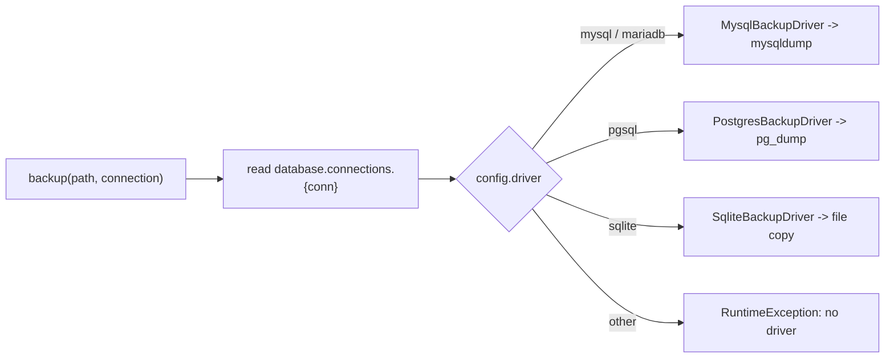

# Backup & restore

`Backup\BackupManager` (bound to `Backup\Contracts\BackupManagerInterface`)
coordinates database backups using a driver pattern, and restores from `.sql`
files via `Backup\SqlFileRestorer`.

```php
use Simtabi\Laranail\DatabaseTools\Backup\Contracts\BackupManagerInterface;

$manager = app(BackupManagerInterface::class);
// or: Simtabi\Laranail\DatabaseTools\DatabaseTools::backup(...)
```

## How drivers are resolved

On construction `BackupManager` registers the three default drivers
(`MysqlBackupDriver`, `PostgresBackupDriver`, `SqliteBackupDriver`). When you
call `backup()`, the manager reads the connection's config, takes its `driver`
value, and asks each registered driver `supports($driver)` until one matches.
If none match it throws a `RuntimeException`.



`supportsDriver(string $driver)` reports whether any registered driver matches a
driver name without performing a backup:

```php
$manager->supportsDriver('pgsql'); // true
$manager->supportsDriver('oracle'); // false
```

## Creating a backup

```php
$manager->backup(storage_path('backups/dump.sql'));            // default connection
$manager->backup(storage_path('backups/pg.dump'), 'pgsql');    // named connection
```

### MySQL / MariaDB

Shells out to `mysqldump`. The password is passed via the `MYSQL_PWD`
environment variable (never on the command line). The connection config must
contain `host`, `username`, `password`, and `database`; `port` (default `3306`)
and `socket` are optional. Writes via `--result-file`.

### PostgreSQL

Shells out to `pg_dump` with `--format=custom --no-password`. The password is
passed via the `PGPASSWORD` environment variable. Requires `host`, `username`,
`password`, `database`; `port` (default `5432`) and `schema` are optional.
Writes via `--file`.

### gzip, excluded tables, and binary paths

The MySQL and PostgreSQL drivers honour the
[`database-tools.backup`](../configuration.md#backup) config:

- `backup.gzip` — when `true`, the dump is gzip-compressed and the driver
  appends `.gz` to the path.
- `backup.exclude` — table names omitted from the dump.
- `backup.binaries.*` — absolute paths to the CLI tools (`mysqldump`, `mysql`,
  `pg_dump`, `pg_restore`, `psql`) when they are not on `PATH`; `null` means
  "rely on `PATH`".

### SQLite

Copies the database file to the backup path (creating the target directory if
needed) and, when present, copies the `-wal` and `-shm` sidecar files too.
Requires the `database` config path. Backing up a `:memory:` database throws a
`RuntimeException`.

## Restoring

```php
$manager->restore(storage_path('backups/dump.sql'));
$manager->restore(storage_path('backups/pg.dump'), 'pgsql');
```

`restore()` is **driver-aware**: it resolves the connection's driver and
delegates to that driver, so the restore mechanism matches the dump format.

- **PostgreSQL custom-format dumps** restore through `pg_restore` (not the
  SQL-text path).
- **MySQL** replays the dump through the `mysql` client.
- **SQLite** uses `SqlFileRestorer` for a plain `.sql` file, or a file copy
  otherwise.

For plain `.sql` text, `SqlFileRestorer`:

1. Validates the file exists, is readable, and is non-empty (else
   `InvalidArgumentException`).
2. Strips single-line (`-- …`) and block (`/* … */`) comments, then splits the
   SQL into statements on `;`, respecting quoted string literals and escaped
   quotes.
3. Executes every statement inside a single transaction (via the
   `ManagesTransactions` trait). A failing statement rolls back the whole
   restore and surfaces a `RuntimeException`.

Gzipped dumps and the optional `pg_restore` / `mysql` / `psql` binary paths from
[`database-tools.backup`](../configuration.md#backup) are honoured on restore
too.

## Importing a dump file

`Files\DatabaseFileService::handleImport()` is a thin, validated entry point for
importing a backup file. It validates the path, extension, and size, then
delegates to the driver-aware `restore()` above — no shell calls happen in the
service itself.

```php
use Simtabi\Laranail\DatabaseTools\Files\Contracts\DatabaseFileServiceInterface;

app(DatabaseFileServiceInterface::class)
    ->handleImport(storage_path('backups/dump.sql'));        // default connection
    // ->handleImport($path, 'pgsql');                       // named connection
```

Only `.sql` and `.dump` files are importable. A live SQLite database file
(`.sqlite` / `.db`) is intentionally refused — importing it would mean swapping
the running database file in place, which is out of scope for a dump import;
`handleImport()` throws a `RuntimeException` for those.

## Custom drivers

`registerDriver()` appends a driver implementing `BackupDriverInterface`
(`backup(array $config, string $path): bool` + `supports(string $driver): bool`)
and returns `$this`, so you can register additional or override database
support.

```php
$manager->registerDriver(new MyCustomBackupDriver());
```

## Reference

```php
// BackupManagerInterface
public function backup(string $path, ?string $connection = null): bool;
public function restore(string $path, ?string $connection = null): bool;
public function supportsDriver(string $driver): bool;

// BackupManager (concrete)
public function registerDriver(BackupDriverInterface $driver): static;

// BackupDriverInterface
public function backup(array $config, string $path): bool;
public function supports(string $driver): bool;
```

---
[← Docs index](../../README.md#documentation)
